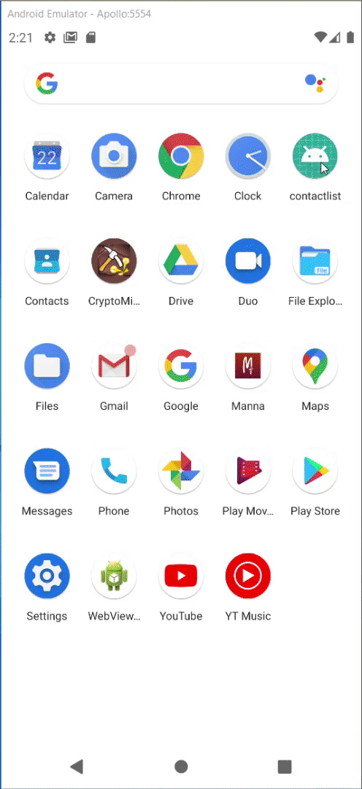

# ReactNativeContactList

Test Task(Contact ListView with Detail View)

- Install latest stable Node.js
- Configure React Native Development environment
   npm i -g react-native
- Running

   git clone https://github.com/Dev-Monster11/ReactNativeContactList.git
   
   cd ReactNativeContactList
   
   npm i --save
   
   ✓<h3>Android</h3>
   
   npm run android
   
   npm start
   <pre>
   
   </pre>
   
   ✓<h3>iOS</h3>
   
   
   cd ios
   
   pod install
   
   npm run ios
   
   npm start

